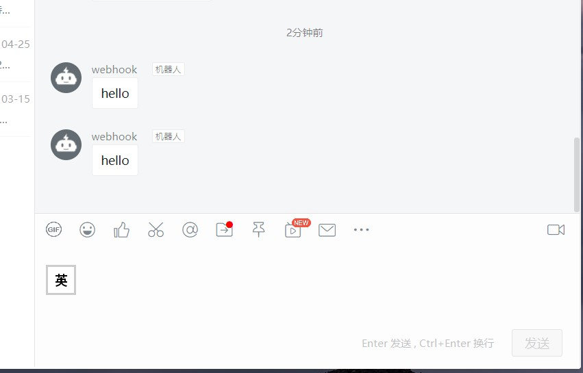

# 钉钉群聊Redis订阅通知

通过订阅redis频道，获取消息并发送至钉钉群聊机器人。

首次运行会生成app.json配置文件，填写完再次运行即可

系统配置示例：

```json
{
    "subscribers": [
        {
            "channel": "my-example",
            "hookUrl": "https://oapi.dingtalk.com/robot/send?access_token={your_token}"
        },
        {
            "channel": "my-example-2",
            "hookUrl": "https://oapi.dingtalk.com/robot/send?access_token={your_token}"
        }
    ],
    "redis": {
        "password": "",
        "address": "127.0.0.1:6379"
    }
}
```

- subscribers.*.channel redis要订阅的频道
- subscribers.*.hookUrl 钉钉群聊机器人webhook参数,在群设置-群机器人-自由添加
- redis.password redis的密码，如果有的话，默认为空
- redis.address redis的连接地址

支持多频道订阅转发至多个群聊

## 运行示例

配置并运行应用


Redis测试输入


结果


