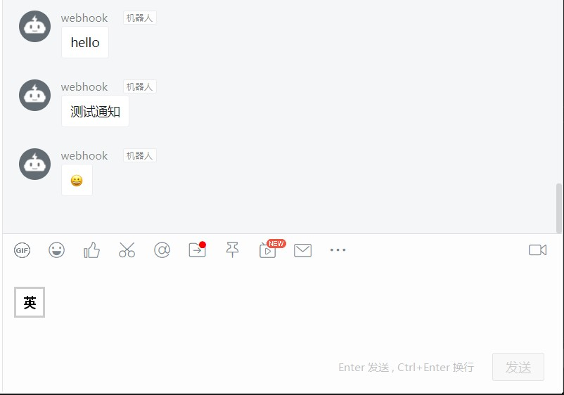

# 钉钉群聊Redis订阅通知

通过订阅redis频道，获取消息并发送至钉钉群聊机器人。

首次运行会生成app.json配置文件，填写完再次运行即可

系统配置示例：

```json
{
    "subscribers": [
        {
            "channel": "my-example",
            "hookUrl": "https://oapi.dingtalk.com/robot/send?access_token={your_token}"
        },
        {
            "channel": "my-example-2",
            "hookUrl": "https://oapi.dingtalk.com/robot/send?access_token={your_token}"
        }
    ],
    "redis": {
        "password": "",
        "address": "127.0.0.1:6379"
    }
}
```

- subscribers.*.channel redis要订阅的频道
- subscribers.*.hookUrl 钉钉群聊机器人webhook参数,在群设置-群机器人-自由添加
- redis.password redis的密码，如果有的话，默认为空
- redis.address redis的连接地址

支持多频道订阅转发至多个群聊

## 运行示例

配置并运行应用

```bash
$ ls
ding-sub
$ chmod +x ding-sub
$ ./ding-sub
2019/05/16 15:03:27 未在程序目录找到配置文件
2019/05/16 15:03:27 配置文件已生成，请填写配置参数
2019/05/16 15:03:27 请先配置app.json参数
$ ls
app.json ding-sub
# 配置文件后运行
$ ./ding-sub
# 以nohup运行
# nohup ./ding-sub >> log.txt &

```

Redis测试输入

```bash
$ redis-cli --raw
127.0.0.1:6379> publish my-example 'hello'
127.0.0.1:6379> publish my-example '测试通知'
127.0.0.1:6379> publish my-example '😀'
```

钉钉群聊


